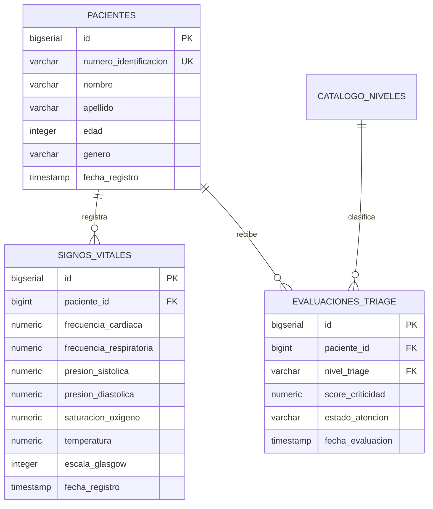

# Modelo Entidad-Relación (Base de Datos Triage)

El diseño relacional garantiza integridad referencial y alta eficiencia para la atención médica.

```mermaid
erDiagram
    PACIENTES ||--o{ SIGNOS_VITALES : "registra"
    PACIENTES ||--o{ EVALUACIONES_TRIAGE : "recibe"
    CATALOGO_NIVELES ||--o{ EVALUACIONES_TRIAGE : "clasifica"

    PACIENTES {
        bigserial id PK
        varchar numero_identificacion UK
        varchar nombre
        varchar apellido
        integer edad
        varchar genero
        timestamp fecha_registro
    }

    SIGNOS_VITALES {
        bigserial id PK
        bigint paciente_id FK
        numeric frecuencia_cardiaca
        numeric frecuencia_respiratoria
        numeric presion_sistolica
        numeric presion_diastolica
        numeric saturacion_oxigeno
        numeric temperatura
        integer escala_glasgow
        timestamp fecha_registro
    }

    EVALUACIONES_TRIAGE {
        bigserial id PK
        bigint paciente_id FK
        varchar nivel_triage FK
        numeric score_criticidad
        varchar estado_atencion
        timestamp fecha_evaluacion
    }
```
